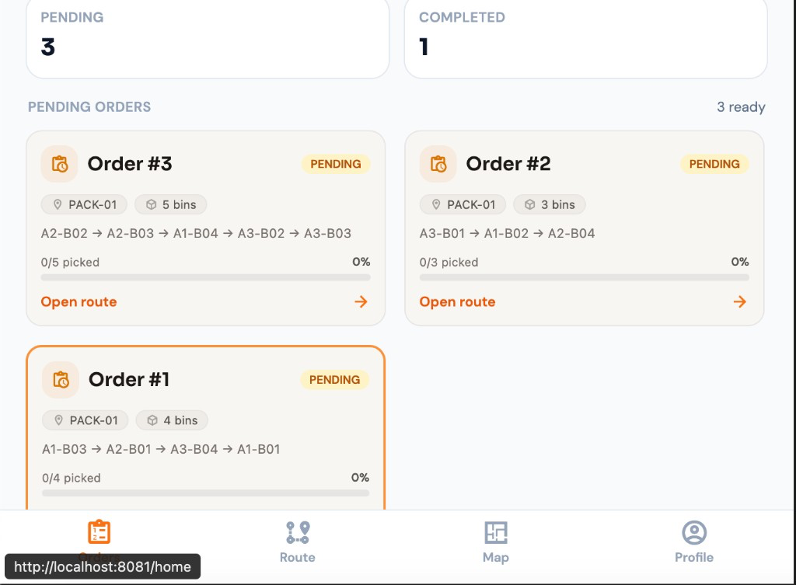
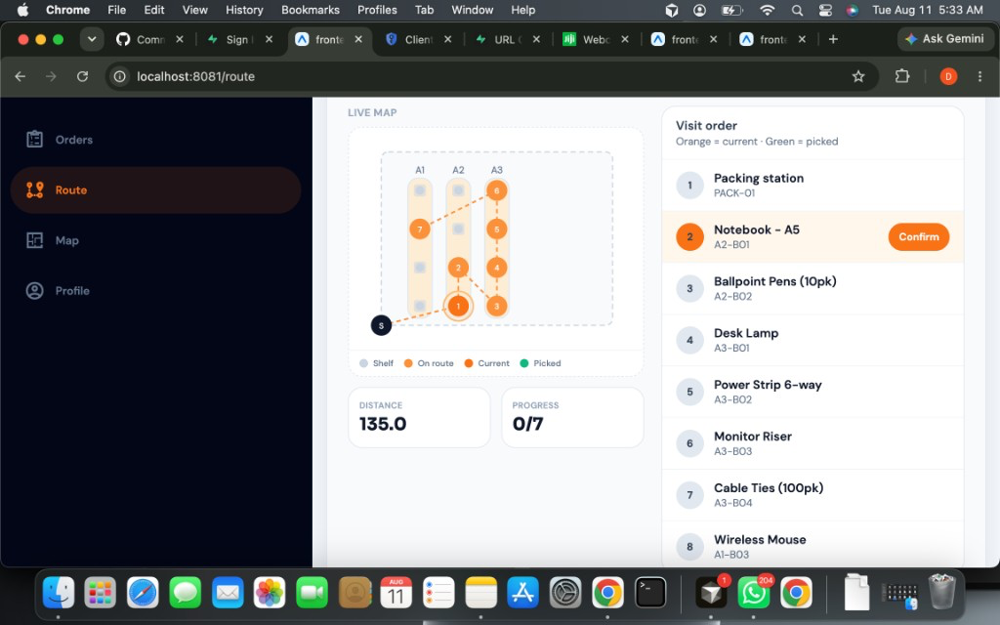
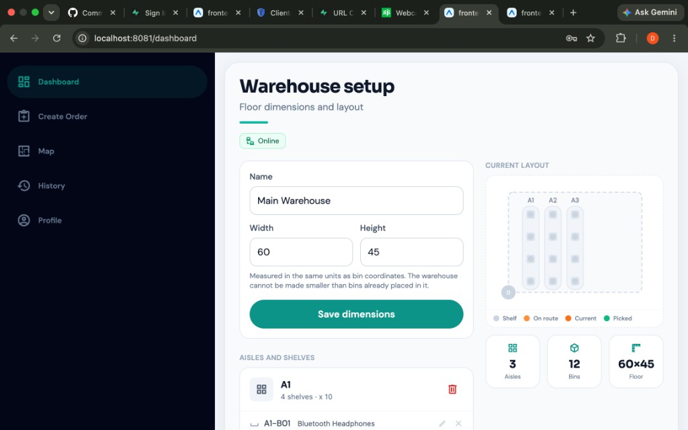
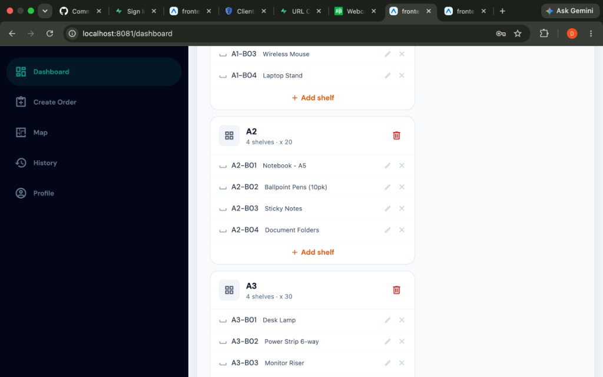

# WarehousePro

**BIT 268 Capstone — Group 73**  
**Project 73: Optimal Warehouse Picking Route Algorithm**

WarehousePro helps warehouse pickers walk shorter routes. Given a packing start (e.g. `PACK-01`) and a pick list of bins, the Spring Boot API computes an aisle-respecting visit order and total distance (Dijkstra for pairwise paths, nearest-neighbor + 2-opt for the tour). An Expo app provides two portals — **picker** (floor queue → route → confirm → complete) and **admin** (warehouse layout, create orders, history) — with Supabase Auth for sessions and roles.

| Portal | Who | Entry |
|---|---|---|
| **Picker** | Floor workers | Onboarding → signup / sign-in |
| **Admin** | Staff only | `/admin/signin` (no public signup) |

Deeper notes: [IMPLEMENTATION.md](./IMPLEMENTATION.md) · frontend guide: [frontend/README.md](./frontend/README.md)

---

## Screenshots

<p align="center">
  
</p>
<p align="center"><em>Picker — Pick queue</em></p>

<p align="center">
  
</p>
<p align="center"><em>Picker — Optimized route (live map + confirm picks)</em></p>

<p align="center">
  
</p>
<p align="center"><em>Admin — Warehouse setup (dimensions + layout)</em></p>

<p align="center">
  
</p>
<p align="center"><em>Admin — Aisles, shelves, and product SKUs</em></p>

---

## Current status

### Done

- [x] Warehouse model (zones, aisles, bins) + H2 / Supabase JPA persistence
- [x] Aisle-constrained routing (Dijkstra + NN / 2-opt)
- [x] REST API: optimize, history, analytics, orders (create / pick / complete)
- [x] Layout CRUD: warehouse, zones, aisles, bins
- [x] CORS for Expo web (including `PATCH` for pick/complete)
- [x] Expo app with **separate** picker and admin navigators (phone bottom tabs / desktop side nav)
- [x] Supabase Auth: email/password + Google OAuth; public signup is **picker-only**
- [x] Change password in Profile (while signed in)
- [x] Password recovery (forgot password email → set new password)
- [x] Admin via `/admin/invite` + invite code, or Supabase Dashboard metadata
- [x] Picker flow: pick queue → optimize route → confirm picks → complete order
- [x] Shared cream order cards (2–3 column grid) + Online / Offline connection chip
- [x] Admin warehouse setup (floor size, aisles/shelves, assign products to bins)
- [x] Admin create-order by bins + History with filters and pick progress
- [x] Shared floor map (picker + admin) — shelves turn green when picked
- [x] Shared Profile (name, phone, avatar, light/dark/system theme)
- [x] Responsive desktop stage that fills beside the nav

### Next (not blocking the demo)

- [ ] Spring Security JWT on `/api/**` (roles enforced server-side)
- [ ] Wire admin UI to route history / analytics endpoints (APIs exist; History is order-based today)
- [ ] Richer warehouse map (per-leg Dijkstra paths)
- [ ] Assign orders to specific pickers
- [ ] EAS / TestFlight shareable build

---

## Stack

| Layer | Tech |
|---|---|
| Backend | Java 17, Spring Boot 3.3.4, Spring Data JPA, Maven |
| Database | H2 (local default) · Supabase PostgreSQL (`supabase` profile) |
| Frontend | Expo, React Native, TypeScript, Expo Router, NativeWind, Zustand |
| Auth | Supabase Auth (email/password + Google; `user_metadata.role`) |
| Fonts | Sora (display) · DM Sans (body) |

---

## Project structure

```text
WarehousePro/
├── README.md
├── IMPLEMENTATION.md
├── docs/screenshots/          # Images shown above (push with the repo)
├── supabase/
│   └── avatars.sql            # Avatar storage bucket + RLS (run once)
├── backend/                   # Spring Boot API + routing algorithm
│   ├── run-supabase.sh        # Starts API with Postgres profile
│   └── src/main/java/com/propro/warehouse/
└── frontend/                  # Expo app
    ├── app/
    │   ├── (auth)/            # Onboarding, picker signup / sign-in
    │   ├── (picker)/          # Orders, Route, Map, Profile
    │   ├── (admin)/           # Setup, Create order, Map, History, Profile
    │   ├── admin/             # Admin sign-in + invite (outside tabs)
    │   └── auth/callback.tsx  # OAuth return
    ├── components/            # Order cards, map, connection banner, …
    ├── lib/                   # API client, Supabase, profile helpers
    ├── store/                 # Active order, auth/theme
    └── types/                 # API DTO mirrors
```

---

## How the product works

### Picker workflow

1. **Orders** — see `PENDING` orders from the API (cream cards, Online/Offline chip)  
2. **Route** — `POST /api/routes/optimize` returns visit order + distance + floor map  
3. **Confirm pick** — `PATCH .../items/{id}/pick` on the current bin  
4. **Complete** — `PATCH .../complete` when every bin is picked  

If no order is selected, Route can run a **demo sample list** (local confirms only; progress is not saved).

### Admin workflow

1. **Dashboard (Warehouse setup)** — floor size, aisles/shelves, product SKUs on bins  
2. **Create** — choose packing start + bins → new `PENDING` order for pickers  
3. **History** — All / Pending / Completed filters, pick progress, durations  
4. **Map / Profile** — shared floor map and the same profile settings as pickers  

### Admin account policy

| Action | Allowed? |
|---|---|
| Public “Sign up as admin” | **No** |
| Picker self-signup | Yes (`role=picker` forced) |
| `/admin/signin` | Existing admin accounts only |
| `/admin/invite` + invite code | Staff provisioning |
| Supabase Dashboard (`role=admin` metadata) | Yes |

Presentation guards (`RequireAdmin` / `RequirePicker`) stop accidental cross-access. Real API authorization still needs Spring Security later.

---

## Features by screen

### Picker tabs

| Tab | What it does |
|---|---|
| **Orders** | Pending queue, stats, open an order to start picking |
| **Route** | Optimized stop order, distance, confirm picks, complete |
| **Map** | Warehouse floor; picked bins highlight green |
| **Profile** | Name, phone, avatar, theme (light/dark/system), sign out |

### Admin tabs

| Tab | What it does |
|---|---|
| **Dashboard** | Warehouse setup (name, floor W×H, aisles, shelves, SKUs) |
| **Create** | Build a pick order → becomes `PENDING` for pickers |
| **Map** | Live layout preview |
| **History** | Order list with filters and progress |
| **Profile** | Same shared profile as pickers (teal accent) |

---

## Accessing the admin portal

There is **no** “Admin” option on public Get Started / signup. Staff use the links below.

### Admin links (local web)

| Purpose | Link |
|---|---|
| **Admin portal (sign in)** | [http://localhost:8081/admin/signin](http://localhost:8081/admin/signin) |
| **Create first admin (invite)** | [http://localhost:8081/admin/invite](http://localhost:8081/admin/invite) |

On a phone or another host, use the same paths on whatever URL Expo shows (e.g. `http://192.168.x.x:8081/admin/signin`).

### How do I get the admin invite code?

The invite code is **not emailed or generated by the server**. Your team chooses it and puts it in the frontend env file:

1. Open `frontend/.env` (copy from `frontend/.env.example` if needed)
2. Set a secret string, for example:

   ```env
   EXPO_PUBLIC_ADMIN_INVITE_CODE=change-me-before-demo
   ```

3. Restart Expo so the value is picked up: `cd frontend && npx expo start -c`
4. Open the **invite** link above and type that **exact** string into the Invite code field

Share the code only with people who should create admin accounts. Anyone who knows it can open `/admin/invite` and register as `role=admin`.

### Prerequisites

1. Frontend running (`cd frontend && npx expo start -c`) — typically **http://localhost:8081**
2. `frontend/.env` filled in, including `EXPO_PUBLIC_ADMIN_INVITE_CODE`
3. After editing `.env`, restart Expo with `-c`

### First time — create an admin account

1. Open **http://localhost:8081/admin/invite**
2. Enter the invite code from `EXPO_PUBLIC_ADMIN_INVITE_CODE`
3. Create the account with email + password **or** Continue with Google  
4. You land on the admin dashboard (or sign in at `/admin/signin` if email confirmation is required)

That flow sets Supabase `user_metadata.role = "admin"`. Google alone on `/admin/signin` will **not** create a new admin.

### Later visits — Admin portal

1. Open **http://localhost:8081/admin/signin**
2. Sign in with email/password or Google (must already be `role=admin`)

Do **not** use the picker “Sign in” screen for admin accounts — it rejects `role=admin`.

### Google Auth (Supabase)

1. [Google Cloud Console](https://console.cloud.google.com/) → OAuth client (Web) → Client ID + Secret  
2. Supabase → **Authentication → Providers → Google** → enable and paste credentials  
3. Supabase → **Authentication → URL Configuration** → Redirect URLs:
   - `http://localhost:8081/auth/callback`
   - `frontend://auth/callback`
4. Restart Metro after any `.env` change: `npx expo start -c`

### Change password (while signed in)

On **Profile**, every user can set a new password themselves (new + confirm → Update password). Prefer this when the account is still accessible — no email is required.

### Password recovery (forgot password)

Use this when someone **cannot sign in**. Picker and admin sign-in both have **Forgot password?**

1. Open forgot-password from the portal you use:
   - Picker: [http://localhost:8081/forgot-password](http://localhost:8081/forgot-password)
   - Admin: [http://localhost:8081/forgot-password?portal=admin](http://localhost:8081/forgot-password?portal=admin)
2. Enter your account email → Supabase sends a reset link
3. Open the link (it returns to `/auth/callback`) → set a new password

**Supabase setup (once):**

1. Authentication → **URL Configuration** → ensure Redirect URLs include `http://localhost:8081/auth/callback` (same as Google)
2. Authentication → **Email Templates** → confirm the “Reset password” template is enabled (default is fine for demos)

**Rate limits:** Supabase free tier only allows a few auth emails per hour. If you see “email rate limit exceeded”, wait about an hour and try **once**, or change the password from Profile while signed in.

Google-only accounts normally sign in with Google; they can still set an email password from Profile if they want.

### Alternative — seed an admin in Supabase

1. Supabase Dashboard → Authentication → Users → add a user  
2. Set metadata to include `"role": "admin"`  
3. Sign in at `/admin/signin`

---

## Backend setup

Requires **Java 17** and **Maven**.

### Local H2 (resets each run)

```bash
cd backend
mvn spring-boot:run
```

API: `http://localhost:8080`  
Sample warehouse data comes from `DataSeeder`.

### Supabase Postgres (persists)

```bash
# backend/.env must define DB_PASSWORD (gitignored)
cd backend
./run-supabase.sh
```

Or:

```bash
mvn spring-boot:run -Dspring-boot.run.profiles=supabase
```

If system Java/Maven are missing, a portable JDK/Maven may live under `.tools/` (gitignored):

```bash
export JAVA_HOME="$PWD/.tools/jdk-17/Contents/Home"
export PATH="$JAVA_HOME/bin:$PWD/.tools/apache-maven/bin:$PATH"
cd backend && mvn spring-boot:run
```

### Hosting the backend (Render)

The API is ready to deploy as a Docker web service against your existing Supabase Postgres.

**What was added for deploy**

- `backend/Dockerfile` — builds the JAR and runs with `SPRING_PROFILES_ACTIVE=supabase`
- `backend/mvnw` — Maven Wrapper (optional native builds)
- `GET /api/health` — liveness check
- `server.port=${PORT:8080}` — works on Render’s dynamic port
- `CORS_ALLOWED_ORIGINS` — comma-separated production frontend URLs (localhost always allowed)
- `render.yaml` — optional Blueprint at the repo root

**Deploy steps (Render)**

1. Push this repo to GitHub (include `backend/Dockerfile` and wrapper files).
2. Go to [https://dashboard.render.com](https://dashboard.render.com) → **New** → **Web Service**.
3. Connect the `WarehousePro` repo.
4. Settings:
   - **Root Directory:** `backend`
   - **Runtime:** Docker
   - **Dockerfile Path:** `./Dockerfile` (relative to root directory)
5. Environment variables:

   | Key | Value |
   |---|---|
   | `SPRING_PROFILES_ACTIVE` | `supabase` |
   | `DB_PASSWORD` | same password as in `backend/.env` (never commit it) |
   | `CORS_ALLOWED_ORIGINS` | leave empty for now; set to your Vercel/Netlify URL when the frontend is hosted |

6. Create the service and wait for the first deploy (free tier can take several minutes).
7. Open `https://<your-service>.onrender.com/api/health` — expect `{"status":"ok"}`.
8. Also try `https://<your-service>.onrender.com/api/orders` — should return JSON.

**Notes**

- Free Render web services **spin down** after idle time; the first request after sleep can take ~30–60s.
- Keep using the Supabase **session pooler** URL already in `application-supabase.properties`.
- Do **not** put `DB_PASSWORD` in git. Set it only in the Render dashboard.
- When the frontend is live, set `CORS_ALLOWED_ORIGINS=https://your-frontend-host` and redeploy (or update env + restart).

**Local check that the Docker image builds** (optional, needs Docker Desktop):

```bash
cd backend
docker build -t warehousepro-api .
docker run --rm -p 8080:8080 -e DB_PASSWORD='your-password' warehousepro-api
```

### Key endpoints

| Method | Path | Purpose |
|---|---|---|
| `GET` | `/api/health` | Liveness (for hosts) |
| `POST` | `/api/routes/optimize` | Optimized bin order + total distance |
| `GET` | `/api/routes/history` | Past optimizations |
| `GET` | `/api/routes/analytics` | Aggregate stats |
| `GET` / `POST` | `/api/orders` | List / create pick orders |
| `PATCH` | `/api/orders/{id}/items/{itemId}/pick` | Confirm one pick |
| `PATCH` | `/api/orders/{id}/complete` | Finish an order |
| CRUD | `/api/warehouse`, `/api/zones`, `/api/aisles`, `/api/bins` | Layout |

Example optimize body:

```json
{
  "startCode": "PACK-01",
  "pickListCodes": ["A1-B03", "A2-B01", "A3-B04", "A1-B01"]
}
```

---

## Frontend setup

```bash
cd frontend
cp .env.example .env
# Set Supabase URL/key, API base URL, admin invite code
npm install
npx expo start -c
```

Open the web app at `http://localhost:8081`, or use Expo Go on a device.

### Environment

| Variable | Purpose |
|---|---|
| `EXPO_PUBLIC_SUPABASE_URL` | Supabase project URL |
| `EXPO_PUBLIC_SUPABASE_PUBLISHABLE_KEY` | Anon / publishable key (never `service_role`) |
| `EXPO_PUBLIC_API_BASE_URL` | Spring API root |
| `EXPO_PUBLIC_ADMIN_INVITE_CODE` | Secret string **you choose** — typed on `/admin/invite` to create admins (see [How do I get the admin invite code?](#how-do-i-get-the-admin-invite-code)) |

**API URL tips**

- Same machine browser → `http://localhost:8080`
- Physical phone on Expo Go → machine **LAN IP**, e.g. `http://192.168.x.x:8080`
- After changing `.env`, restart Metro with `npx expo start -c`

Optional (once): run [`supabase/avatars.sql`](./supabase/avatars.sql) in the Supabase SQL editor so Profile photo uploads work.

The UI shows a compact **Online** / **Offline** chip so API problems are obvious.

---

## Quick demo checklist

1. Backend running → `curl http://localhost:8080/api/orders` returns JSON  
2. Frontend → green **Online** chip on Orders  
3. Admin (once): `/admin/invite` with invite code → `/admin/signin` → Create order  
4. Picker: open that `PENDING` order → confirm bins → complete  
5. Admin: History shows the completed order  

---

## Capstone relevance

- Graph search + TSP-style heuristics for a real warehouse productivity problem  
- Relational persistence and REST API design  
- Role-separated client UX (picker vs locked-down admin)  
- Practical demo path from optimize → pick → complete → history  
